# Линейная регрессия

---
## Матричное представление линейной регрессии
Для всех $n$ объектов:

$$\mathbf{y} = \mathbf{X}\boldsymbol{\omega} + \boldsymbol{\varepsilon}$$

где:
- $\mathbf{y}$ — вектор наблюдений размера $n \times 1$, где $\mathbf{y} = [y_1, y_2, \ldots, y_n]^T$
- $\mathbf{X}$ — матрица признаков размера $n \times (p+1)$
- $\boldsymbol{\varepsilon}$ — вектор ошибок размера $n \times 1$, где $\boldsymbol{\varepsilon} = [\varepsilon_1, \varepsilon_2, \ldots, \varepsilon_n]^T$

---

Для одного объекта $i$:

$$y_i = \mathbf{x}_i^T \boldsymbol{\omega} + \varepsilon_i$$

где:
- $y_i$ — наблюдение для $i$-го объекта
- $\mathbf{x}_i$ — вектор признаков для $i$-го объекта, где $\mathbf{x}_i = [1, x_{i1}, x_{i2}, x_{i3}, \ldots, x_{ip}]$
- $\boldsymbol{\omega}$ — вектор коэффициентов, где $\boldsymbol{\omega} = [\omega_0, \omega_1, \omega_2, \ldots, \omega_p]^T$
- $\varepsilon_i$ — ошибка для $i$-го объекта

---

### Решение методом наименьших квадратов (МНК)
Функция потерь (MSE): 
$$J(\boldsymbol{\omega}) = \|\mathbf{y} - \mathbf{X}\boldsymbol{\omega}\|^2_2 = (\mathbf{y} - \mathbf{X}\boldsymbol{\omega})^T(\mathbf{y} - \mathbf{X}\boldsymbol{\omega})$$

Оценка коэффициентов:

$$\hat{\boldsymbol{\omega}} = (\mathbf{X}^T\mathbf{X})^{-1}\mathbf{X}^T\mathbf{y}$$

Предсказанные значения:

$$\hat{\mathbf{y}} = \mathbf{X}\hat{\boldsymbol{\omega}}$$

---

## Теорема Гаусса-Маркова

При выполнении условий:
1. $\mathbb{E}[\varepsilon_i | \mathbf{X}] = 0$
2. $\text{Var}(\varepsilon_i | \mathbf{X}) = \sigma^2 < \infty$
3. $\text{Cov}(\varepsilon_i, \varepsilon_j | \mathbf{X}) = 0$ при $i \neq j$

МНК-оценка $\hat{\boldsymbol{\omega}}$ является **наилучшей линейной несмещенной оценкой** (BLUE).

---
Одни из возможных проблем МНК:
- Не работает при Мультиколлинеарности(высокая корреляция между признаками или коллинеарность)
- Вычислительная сложность O(mn² + n³), где (m — число наблюдений, n — число признаков).
- Отсутствие валидации и защиты от переобучения
- только одна функция потерь (MSE)

--- 
## решение мультиколлинеарности:
- Исключение избыточных признаков
- Регуляризация (Ridge, Lasso)

---
## Регуляризация
### Ridge-регрессия (L2-регуляризация)
Минимизируемая функция потерь:
$$J(\boldsymbol{\omega}) = \|\mathbf{y} - \mathbf{X}\boldsymbol{\omega}\|^2_2 + \lambda \|\boldsymbol{\omega}\|^2_2$$
где $\|\boldsymbol{\omega}\|^2_2 = \sum_{j=1}^{p} \omega_j^2$
Оценка коэффициентов:
$$\hat{\boldsymbol{\omega}}_{ridge} = (\mathbf{X}^T\mathbf{X} + \lambda \mathbf{I})^{-1}\mathbf{X}^T\mathbf{y}$$

**Особенности L2-регуляризации:**
- Ограничивает веса (constraints weights)
- Обеспечивает более стабильное решение
- Дифференцируема

---
### Lasso-регрессия (L1-регуляризация)
Минимизируемая функция потерь:
$$J(\boldsymbol{\omega}) = \|\mathbf{y} - \mathbf{X}\boldsymbol{\omega}\|^2_2 + \lambda \|\boldsymbol{\omega}\|_1$$
где $\|\boldsymbol{\omega}\|_1 = \sum_{j=1}^{p} |\omega_j|$
уже нет аналитического решения, используется численная оптимизация (например, метод координатного спуска).

**Особенности L1-регуляризации:**
- Недифференцируема (но это не проблема)
- Выполняет отбор признаков (обнуляет некоторые коэффициенты)

---

### основные метрики качества линейной регрессии:
- Среднеквадратичная ошибка (MSE):
$$\text{MSE} = \frac{1}{n} \sum_{i=1}^{n} (y_i - \hat{y}_i)^2$$
- Средняя абсолютная ошибка (MAE):
$$\text{MAE} = \frac{1}{n} \sum_{i=1}^{n} |y_i - \hat{y}_i|$$
- Коэффициент детерминации (R²):
$$R^2 = 1 - \frac{\sum_{i=1}^{n} (y_i - \hat{y}_i)^2}{\sum_{i=1}^{n} (y_i - \bar{y})^2}$$
где $\bar{y} = \frac{1}{n} \sum_{i=1}^{n} y_i$ — среднее значение наблюдений.

---

и еще 
- Средняя абсолютная процентная ошибка (MAPE):
$$\text{MAPE} = \frac{100\%}{n} \sum_{i=1}^{n} \left| \frac{y_i - \hat{y}_i}{y_i} \right|$$
- Корень из среднеквадратичной ошибки (RMSE):
$$\text{RMSE} = \sqrt{\frac{1}{n} \sum_{i=1}^{n} (y_i - \hat{y}_i)^2}$$

---

### методы оптимизации для линейной регрессии:
- Градиентный спуск
- Стохастический градиентный спуск (SGD)

---

### Метод градиентного спуска
Обновление коэффициентов:
$$\boldsymbol{\omega}^{(t+1)} = \boldsymbol{\omega}^{(t)} - \alpha \nabla J(\boldsymbol{\omega}^{(t)})$$
где $\alpha$ — скорость обучения, а градиент функции потерь:
для MSE:
$$\nabla J(\boldsymbol{\omega}) = -\frac{2}{n} \mathbf{X}^T (\mathbf{y} - \mathbf{X}\boldsymbol{\omega})$$
для Ridge-регрессии:
$$\nabla J(\boldsymbol{\omega}) = -\frac{2}{n} \mathbf{X}^T (\mathbf{y} - \mathbf{X}\boldsymbol{\omega}) + 2\lambda \boldsymbol{\omega}$$
для Lasso-регрессии:
$$\nabla J(\boldsymbol{\omega}) = -\frac{2}{n} \mathbf{X}^T (\mathbf{y} - \mathbf{X}\boldsymbol{\omega}) + \lambda \cdot \text{sign}(\boldsymbol{\omega})$$

---

Ненормированные данные
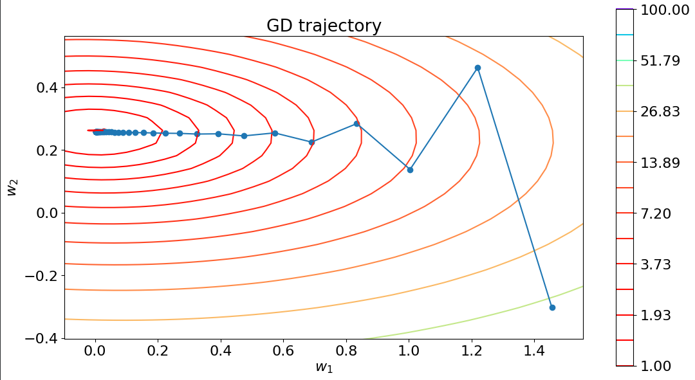

---
Нормированные данные
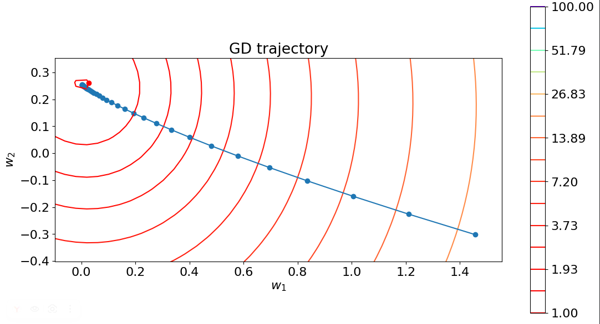

---

Для MAE градиент не определен в точках, где ошибка равна нулю, поэтому используют субградиент: 
$$\nabla J(\boldsymbol{\omega}) = -\frac{1}{n} \mathbf{X}^T \text{sign}(\mathbf{y} - \mathbf{X}\boldsymbol{\omega})$$
где $\text{sign}(z)$ — функция знака, определяемая как:
$$\text{sign}(z) = \begin{cases} 1, & \text{если } z > 0 \\ 0, & \text{если } z = 0 \\ -1, & \text{если } z < 0 \end{cases}$$

---

## Стохастический градиентный спуск (SGD)

В отличие от обычного градиентного спуска, который использует все данные для вычисления градиента, **SGD обновляет веса на основе градиента для одного случайного объекта** (или мини-батча объектов).

**Преимущества:**
- Быстрее для больших датасетов
- Может избежать локальных минимумов
- Меньше требований к памяти

---

### Обновление коэффициентов в SGD
Обновление коэффициентов для каждого объекта $i$:
$$\boldsymbol{\omega}^{(t+1)} = \boldsymbol{\omega}^{(t)} - \alpha \nabla J_i(\boldsymbol{\omega}^{(t)})$$
где градиент функции потерь для объекта $i$:
для MSE:
$$\nabla J_i(\boldsymbol{\omega}) = -2 \mathbf{x}_i (y_i - \mathbf{x}_i^T \boldsymbol{\omega})$$

---

Ненормированные данные
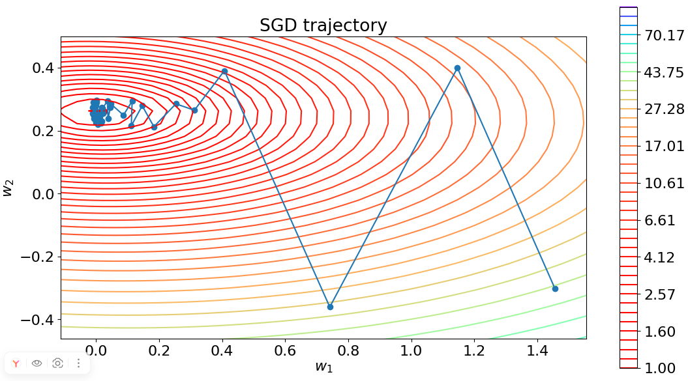

---
Нормированные данные

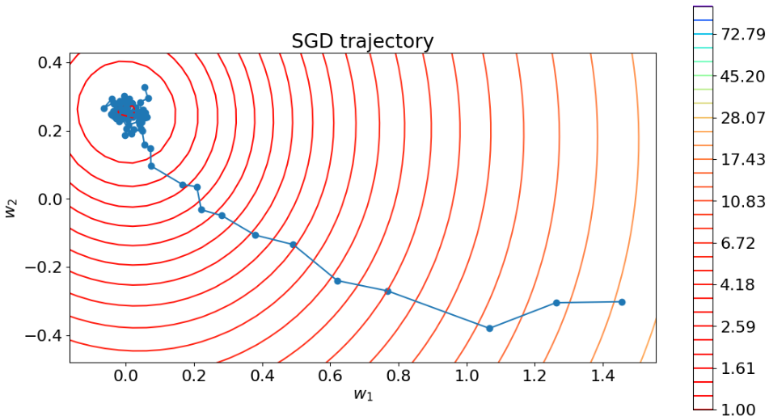

---

## Обучение с учителем (Supervised Learning)

**Обозначения:**

- **Обучающая выборка** $\mathcal{L} = \{\mathbf{x}_i, y_i\}_{i=1}^n$, где:
  - $(\mathbf{x} \in \mathbb{R}^p, y \in \mathbb{R})$ — для регрессии
  - $\mathbf{x}_i \in \mathbb{R}^p, y_i \in \{+1, -1\}$ — для бинарной классификации
  
- **Модель** $f(\mathbf{x})$ предсказывает значение для каждого объекта

- **Функция потерь** $Q(\mathbf{x}, y, f)$, которую нужно минимизировать 

---

### переобучение (overfitting) и недообучение (underfitting)
| 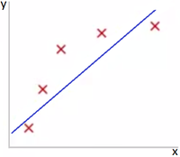 | 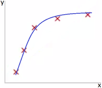 | 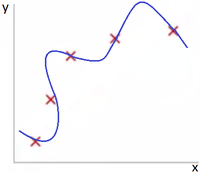 |
|---|---|---|
| Недообучение| Оптимальная сложность | Переобучение |

- **Недообучение (underfitting)**: модель слишком простая, не может объяснить дисперсию данных
- **Переобучение (overfitting)**: модель слишком сложная, хорошо работает на обучающей выборке, но плохо на новых данных
- **Оптимальная модель**: баланс между сложностью модели и её способностью обобщать

---

### Контроль переобучения и недообучения

Можно контролировать переобучение / недообучение, изменяя **ёмкость модели** (способность аппроксимировать широкий спектр функций):

- Выбор подходящего пространства гипотез
- Эффективная ёмкость алгоритма обучения может быть меньше, чем репрезентативная ёмкость семейства моделей

---
### Holdout-метод
Разделение данных на две части:
- Обучающая выборка (training set)
- Тестовая выборка (test set)

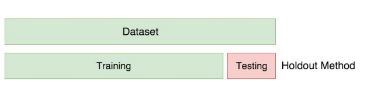

---

<!-- - Обучающая выборка используется для обучения модели
- Тестовая выборка используется для окончательной оценки качества модели

--- -->

### Кросс-валидация и разбиение данных

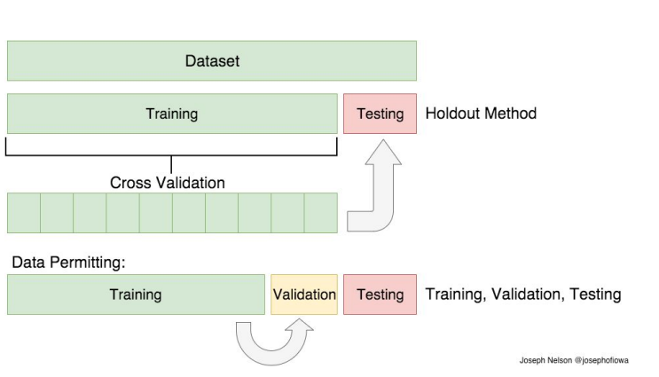

---

### K-Fold Кросс-валидация

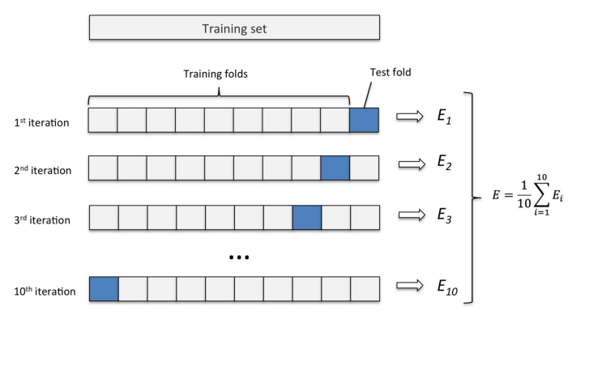

---

### Метод главных компонент (PCA)
- Каждая главная компонента объясняет максимальную дисперсию данных
- Главные компоненты ортогональны друг другу
- Переход (проекция) в пространство ГК: $\mathbf{A} \mapsto \boldsymbol{\Sigma}$
- Для ковариационной матрицы $\boldsymbol{\Sigma}$: диагональ $\Sigma_{jj}$ — это дисперсии (variance) признаков

| 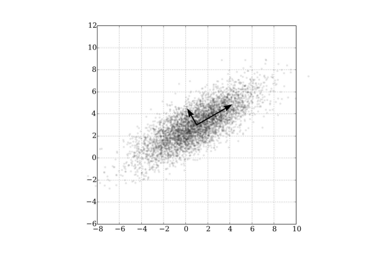 | **Данные надо Масштабировать перед применением PCA!** |
|---|---|

